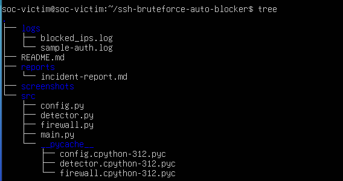
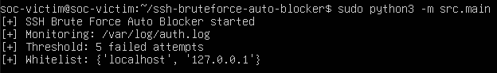
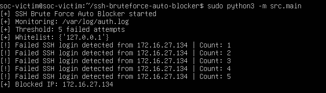
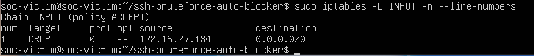
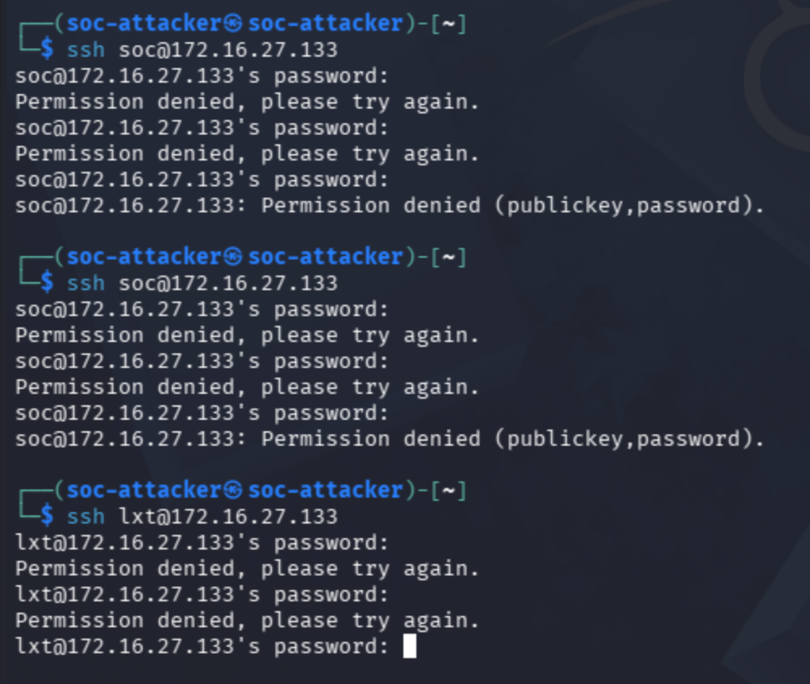
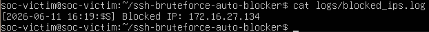

# SSH Brute Force Auto Blocker

## 1. Overview

SSH Brute Force Auto Blocker is a Python-based security project that monitors SSH authentication logs on a Linux server and automatically blocks suspicious IP addresses after multiple failed login attempts.

This project simulates a basic Blue Team / SOC scenario where a system detects SSH brute force activity from log files and responds by adding a firewall rule to block the attacker IP.

## 2. Project Objectives

The main objectives of this project are:

* Monitor SSH authentication logs on Linux.
* Detect repeated failed SSH login attempts.
* Extract suspicious source IP addresses from log entries.
* Automatically block attacker IPs using `iptables`.
* Save blocked IP information into a log file.
* Practice basic incident detection and response.

## 3. Lab Environment

The lab includes two main machines:

* **Victim machine**: Ubuntu Server running SSH service and the auto blocker tool.
* **Attacker machine**: Kali Linux or Ubuntu used to simulate failed SSH login attempts.

When the attacker tries to log in with the wrong password multiple times, the victim machine records failed login events in `/var/log/auth.log`. The Python tool reads these logs, counts failed attempts by IP address, and blocks the attacker IP if the threshold is reached.

## 4. Project Structure

```bash
ssh-bruteforce-auto-blocker/
├── logs/
│   └── sample-auth.log
├── reports/
│   └── incident-report.md
├── screenshots/
│   ├── 01-project-structure.png
│   ├── 02-firewall-started.png
│   ├── 03-ssh-bruteforce-detected.png
│   ├── 04-iptables-blocked-ip.png
│   ├── 05-attacker-ssh-failed-login.png
│   └── 06-blocked-ips-log.png
├── src/
│   ├── config.py
│   ├── detector.py
│   ├── firewall.py
│   └── main.py
└── README.md
```

## 5. How It Works

The tool works as follows:

1. Monitors the SSH log file located at `/var/log/auth.log`.
2. Searches for failed SSH login attempts.
3. Extracts the source IP address from each failed login entry.
4. Counts the number of failed attempts for each IP address.
5. If an IP reaches the configured threshold, the tool blocks it using `iptables`.
6. The blocked IP is saved into `logs/blocked_ips.log`.

Example detection threshold:

```bash
Threshold: 5 failed attempts
```

When an IP address reaches 5 failed SSH login attempts, it will be blocked automatically.

## 6. How to Run

Run the tool on the victim machine:

```bash
sudo python3 -m src.main
```

The tool requires `sudo` privileges because it needs to:

* Read `/var/log/auth.log`.
* Add firewall rules using `iptables`.

## 7. Testing the Attack

From the attacker machine, try to log in to the victim machine using SSH with an incorrect password:

```bash
ssh username@victim_ip
```

After several failed login attempts, the victim machine should detect the brute force behavior and block the attacker IP.

## 8. Check Firewall Rules

After the attacker IP is blocked, check the `iptables` INPUT chain:

```bash
sudo iptables -L INPUT -n --line-numbers
```

Example output:

```bash
Chain INPUT (policy ACCEPT)
num  target  prot  opt  source          destination
1    DROP    0     --   172.16.27.134   0.0.0.0/0
```

This shows that the attacker IP `172.16.27.134` has been blocked.

## 9. Check Blocked IP Log

Blocked IP addresses are saved in:

```bash
logs/blocked_ips.log
```

To view the log:

```bash
cat logs/blocked_ips.log
```

Example output:

```bash
[2026-06-11 16:19:55] Blocked IP: 172.16.27.134
```

## 10. Screenshots

### Project Structure



### Tool Started Successfully



### SSH Brute Force Detection



### Attacker IP Blocked by iptables



### Failed SSH Login Attempts from Attacker



### Blocked IP Log File



## 11. Results

The project successfully demonstrates a simple SSH brute force detection and response workflow:

* The attacker performs multiple failed SSH login attempts.
* The victim machine records failed login events in `/var/log/auth.log`.
* The Python tool detects repeated failed login attempts from the same IP address.
* The attacker IP is blocked automatically using `iptables`.
* The blocked IP is recorded in a log file.

## 12. Skills Demonstrated

This project demonstrates basic skills in:

* Linux log analysis
* SSH authentication monitoring
* Python scripting
* Regular Expression for IP extraction
* Linux firewall management with `iptables`
* Brute force detection
* Basic incident response
* Blue Team security operations

## 13. Disclaimer

This project is created for educational and lab purposes only. It should only be used in a controlled environment or on systems that you own or have permission to test.

