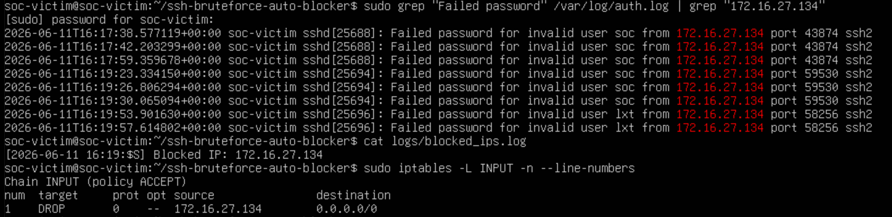

# Incident Report: SSH Brute Force Detection and Auto Blocking

## 1. Incident Summary

This report describes a simulated SSH brute force attack in a controlled lab environment. The attacker machine attempted to log in to the victim machine multiple times using invalid SSH credentials. The SSH Brute Force Auto Blocker detected repeated failed login attempts from the same source IP address and automatically blocked the attacker IP using `iptables`.

## 2. Lab Environment

* **Victim Machine**: Ubuntu Server
* **Victim Hostname**: `soc-victim`
* **Attacker Machine**: Kali Linux / Ubuntu
* **Attacker IP Address**: `172.16.27.134`
* **Monitored Log File**: `/var/log/auth.log`
* **Detection Tool**: Python SSH Brute Force Auto Blocker
* **Firewall Tool**: `iptables`

## 3. Incident Timeline

| Time                | Event                                                                                 |
| ------------------- | ------------------------------------------------------------------------------------- |
| 2026-06-11 16:17:38 | First failed SSH login attempt detected from `172.16.27.134` using invalid user `soc` |
| 2026-06-11 16:17:42 | Another failed SSH login attempt detected from `172.16.27.134`                        |
| 2026-06-11 16:17:59 | Continued failed SSH login attempt from the same attacker IP                          |
| 2026-06-11 16:19:23 | New failed SSH login attempt detected from `172.16.27.134` using invalid user `soc`   |
| 2026-06-11 16:19:26 | Failed login attempts continued from the same source IP                               |
| 2026-06-11 16:19:30 | The failed login count reached the configured detection threshold                     |
| 2026-06-11 16:19:53 | Failed SSH login attempt detected using invalid user `lxt`                            |
| 2026-06-11 16:19:55 | The attacker IP `172.16.27.134` was blocked and recorded in `logs/blocked_ips.log`    |
| 2026-06-11 16:19:57 | Additional failed login activity was still visible in the authentication log          |
| After detection     | The IP `172.16.27.134` was confirmed as blocked in the `iptables` INPUT chain         |

## 4. Detection Evidence

The victim machine recorded multiple failed SSH login attempts in `/var/log/auth.log`.

Command used to check failed SSH login attempts:

```bash
sudo grep "Failed password" /var/log/auth.log | grep "172.16.27.134"
```

Observed log entries:

```bash
2026-06-11T16:17:38.577119+00:00 soc-victim sshd[25688]: Failed password for invalid user soc from 172.16.27.134 port 43874 ssh2
2026-06-11T16:17:42.203299+00:00 soc-victim sshd[25688]: Failed password for invalid user soc from 172.16.27.134 port 43874 ssh2
2026-06-11T16:17:59.359678+00:00 soc-victim sshd[25688]: Failed password for invalid user soc from 172.16.27.134 port 43874 ssh2
2026-06-11T16:19:23.334150+00:00 soc-victim sshd[25694]: Failed password for invalid user soc from 172.16.27.134 port 59530 ssh2
2026-06-11T16:19:26.806294+00:00 soc-victim sshd[25694]: Failed password for invalid user soc from 172.16.27.134 port 59530 ssh2
2026-06-11T16:19:30.065094+00:00 soc-victim sshd[25694]: Failed password for invalid user soc from 172.16.27.134 port 59530 ssh2
2026-06-11T16:19:53.901630+00:00 soc-victim sshd[25696]: Failed password for invalid user lxt from 172.16.27.134 port 58256 ssh2
2026-06-11T16:19:57.614802+00:00 soc-victim sshd[25696]: Failed password for invalid user lxt from 172.16.27.134 port 58256 ssh2
```

These log entries show that the same source IP address repeatedly attempted to authenticate through SSH using invalid credentials.

## 5. Blocked IP Evidence

After the failed login attempts reached the configured threshold, the tool recorded the blocked IP in `logs/blocked_ips.log`.

Command used:

```bash
cat logs/blocked_ips.log
```

Observed result:

```bash
[2026-06-11 16:19:55] Blocked IP: 172.16.27.134
```

This confirms that the attacker IP was detected and logged by the auto blocker.

## 6. Firewall Evidence

The attacker IP was confirmed in the `iptables` INPUT chain.

Command used:

```bash
sudo iptables -L INPUT -n --line-numbers
```

Observed result:

```bash
Chain INPUT (policy ACCEPT)
num  target  prot  opt  source          destination
1    DROP    0     --   172.16.27.134   0.0.0.0/0
```

This shows that incoming traffic from `172.16.27.134` was dropped by the victim machine.

## 7. Evidence Screenshot

The following screenshot shows the main evidence collected from the victim machine, including failed SSH login attempts, the blocked IP log, and the `iptables` rule that blocked the attacker IP.



## 8. Impact

The attacker attempted to access the victim machine through SSH by repeatedly trying invalid usernames and passwords. If weak credentials were used, this type of attack could lead to unauthorized access. In this lab, the attack was detected and the attacker IP was blocked automatically before any successful login occurred.

## 9. Response Actions

The following response actions were performed:

* Monitored SSH authentication logs on the victim machine.
* Detected repeated failed SSH login attempts from `172.16.27.134`.
* Extracted the attacker IP address from `/var/log/auth.log`.
* Blocked the attacker IP using `iptables`.
* Recorded the blocked IP in `logs/blocked_ips.log`.
* Verified the firewall rule using `iptables`.

## 10. Recommendations

To reduce the risk of SSH brute force attacks, the following security measures are recommended:

* Use strong passwords or SSH key-based authentication.
* Disable SSH login for the root account.
* Disable password authentication if SSH keys are used.
* Restrict SSH access to trusted IP addresses.
* Monitor `/var/log/auth.log` regularly.
* Use tools such as Fail2Ban or a SIEM system for automated detection and alerting.
* Review firewall rules periodically.

## 11. Conclusion

The lab successfully demonstrated a basic SSH brute force detection and response workflow. The attacker IP `172.16.27.134` generated multiple failed SSH login attempts against the victim machine. The Python auto blocker detected the suspicious behavior, blocked the attacker IP using `iptables`, and saved the event in a log file.

This project demonstrates fundamental Blue Team skills such as Linux log analysis, brute force detection, firewall response, and incident documentation.

